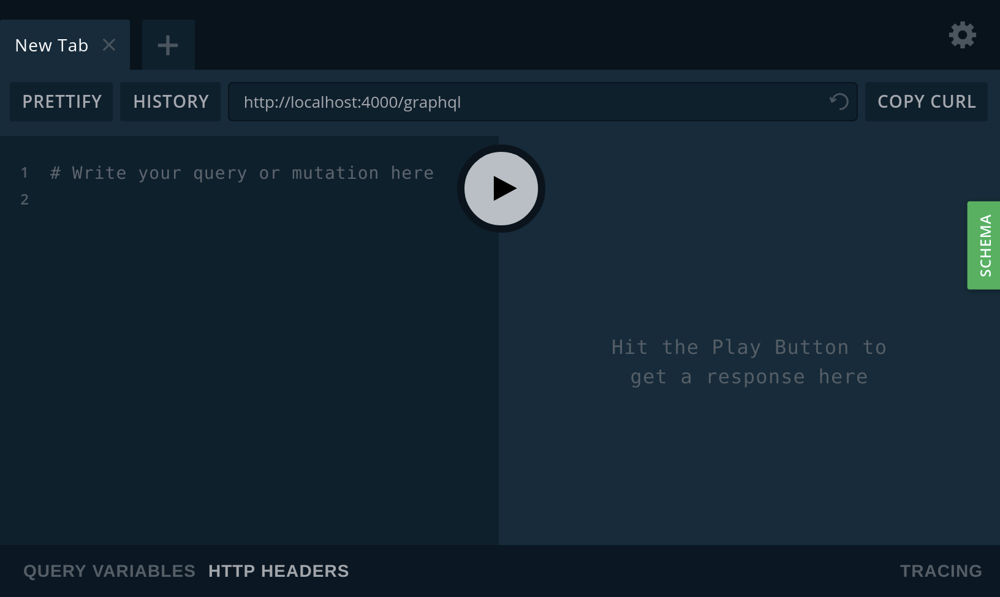

<h1 align="center">
  <a href="https://github.com/pi2-fga/201901-InspecaoCaboDeAco-MainServer" target="_blank">
    
  </a>
</h1>

<p align="center">
  Este projeto é referente ao Main Server do projeto Inspeção de Cabo de Aço da disciplina de PI2, desenvolvido em:<br>
  <strong>Node.js, GraphQL, AVA, Knex, PostgreSQL e Docker.</strong>
</p>

<p align="center">
  <a href="https://nodejs.org/es/blog/release/v10.15.3/">
    
  </a>
  <a href="https://graphql.org/">
    
  </a>
  <a href="https://github.com/avajs/ava">
    
  </a>
  <a href="https://knexjs.org/">
    
  </a>
  <a href="https://www.postgresql.org/">
    
  </a>
</p>

## 📋 Requisitos

Para rodar o projeto, basta ter o Git, Docker e o Docker Compose instalados.

## 💻 Rodando a aplicação

O primeiro passo é clonar o projeto e em seguida entrar em sua raiz:

```sh
git clone git@github.com:pi2-inspecao-cabo-de-aco/main-server.git && cd main-server
```

Para baixar as imagens e subir os containers, rode o comando:

```sh
docker-compose up --build
```

Caso seja necessário, para rodar as _migrations_, utilize o comando:

```sh
docker-compose exec server yarn db:migrate
```

Após isso, o _backend_ estará disponível e alguns serviços ficam prontos para uso.

### GraphiQL

O GraphiQL é uma interface gráfica onde é possível testar todas `queries`, `mutatations` e `subscriptions` da aplicação. Ao clicar no botão `SCHEMA`, é possível ver uma mini documentação que contém todas elas, onde é possível observar todos os atributos de cada `type`.

<a href="http://localhost:4000/graphql" target="_blank">
  
</a>

## 📂 Estrutura

```
main-server/
├── migrations/
│   ├── 20190509021053_create_table_reports.js
│   ├── 20190510012439_create_table_cable.js
│   └── ...
├── public/
│   └── ...
├── scripts/
│   └── ...
├── seeds/
│   └── index.js
├── src
│   ├── api/
│   ├── helpers/
│   ├── lib/
│   ├── mutations/
│   ├── queries/
│   ├── subscriptions/
│   └── ...
└── test
    ├── fixture/
    ├── specs/
    └── ...
```

**migrations:** Aqui, armazena-ze todas as migrações realizadas pelo módulo [Knex](https://knexjs.org/). Esse _query builder_ nos permite gerar todo o `schema` do banco de dados, com as tabelas, seus tipos e relações.

**scripts:** Todo e qualquer `script` a ser executado para realizar alguma ação no banco, formatar algum dado de entrada, configurar ambiente ou coisas afins, devem ser armazenados nesse diretório.

**seed:** Armazenam todos os arquivos que irão popular o banco de dados previamente para o devido desenvolvimento do projeto.

**src:** Contém todos os arquivos da aplicação em específico, onde:
- api: armazena todos os aquivos que são exeutados via requisições HTTP por meio do protocolo REST;
- helpers: arquivos com funções genéricas geralmente compartilhadas por um ou mais arquivos ou módulos;
- mutations: arquivos de _mutations_ geradas manualmente em caso de necessidade. São os chamados `custom-resolvers` para as mutations do GraphQl;
- queries: similar ao diretório de _mutations_, este diretório armazena os `custom-resolvers` de _queries_.
- subscriptions: similar ao diretório de _queries_ e _mutations_, esta pasta é armazena os `custom-resolvers` de _subscriptions_.

**test:** Arquivos para testes do sistema.

## ✅ Testes

Para rodar os testes execute o comando:

```sh
docker-compose exec server yarn test
```
Após rodar os testes, para ver a cobertura basta abrir o arquivo `coverage/index.html` no navegador e navegar entre as pastas/arquivos para ter mais detalhes.

## ⚠ Informações importantes

### Mudança no _Schema_

Quando hover uma mudança em alguma tabela, seja ela relacionado às suas relações ou à seus atributos, deve-se criar uma nova _migration_ para não haver problemas futuros. Para isto, basca executar o comando abaixo e escrever a mudança no arquivo que será criado:

```sh
docker-compose exec server yarn knex migrate:make <migration_name>
```

### Popular o banco de dados

Para popular o banco, basta utilizar o _seed_, executando o comando abaixo:

```sh
docker-compose exec server yarn seed
```
